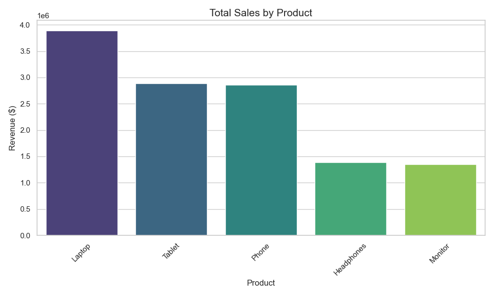
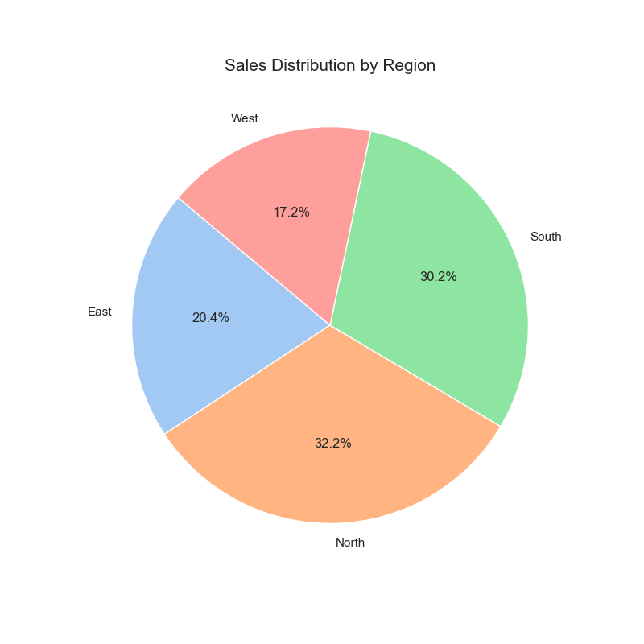
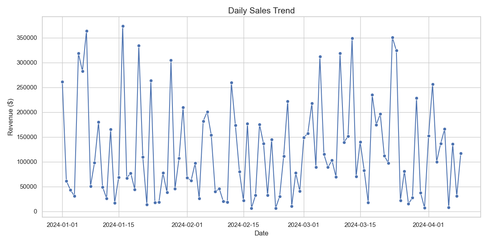

# Sales Data Analysis Report

## Executive Summary
This report analyzes the sales performance based on the provided dataset.

## Key Metrics
- **Total Revenue**: $12,365,048.00
- **Average Order Value**: $123,650.48
- **Total Units Sold**: 478
- **Unique Customers**: 100

## Visual Insights

### 1. Product Performance

*Insight: Laptop and Phone are the primary revenue drivers for the business.*

### 2. Regional Distribution

*Insight: The North region shows the highest market share, followed closely by South.*

### 3. Sales Trends

*Insight: There is significant daily fluctuation, indicating potential seasonal or promotional influences.*

## Conclusion
The business should focus on maintaining inventory for high-value items like Laptops and potentially investigate the lower sales in certain regions to identify growth opportunities.
